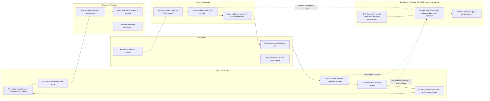

# Order-to-Spread Swimlane (New Haven-Style) — Source-Validated Draft v1

## Scope
End-to-end process from municipal order planning through field spread operations for a waterfront-influenced supply chain (City + terminal operator + supplier + transporter + regulator).

## Swimlane Diagram (Mermaid)

## Step-by-step with evidence links

1. **Stormwater/permit guardrails define handling obligations** (MS4 + industrial + transportation stormwater categories)  
   - EPA NPDES Stormwater Program: https://www.epa.gov/npdes/npdes-stormwater-program  
   - eCFR NPDES permitting framework (40 CFR Part 122): https://www.ecfr.gov/current/title-40/chapter-I/subchapter-D/part-122

2. **City plans demand and issues order/release** under winter maintenance program controls  
   - FHWA snow/ice operations context (scale, operations, cost pressure): https://ops.fhwa.dot.gov/weather/weather_events/snow_ice.htm

3. **Supplier allocates and ships via multimodal network** (vessel/barge/rail/truck depending on market and season)  
   - Compass Minerals logistics statement (rail/truck/barge/vessel): https://www.compassminerals.com/what-we-do/salt/highway-deicing/

4. **Terminal receives and transloads bulk salt** for municipal trucking  
   - New Haven-specific terminal flow should be validated with local operator docs/contracts (project action item).

5. **Transporter delivers to municipal storage** and supports surge operations during storm windows  
   - Operational best-practice structure/resources: https://www.clearroads.org/research-by-topic/

6. **City stores, dispatches, spreads, and records** use/compliance evidence  
   - Permit/BMP logic again anchored in NPDES stormwater sources above.

## Validation status

- **Validated (source-backed):**
  - Stormwater permit logic and need for BMP/SOP controls.
  - Existence of multimodal deicing supply networks.
  - Municipal winter operations context and budget/operational pressure.
- **Needs local-source closure (New Haven-specific):**
  - Exact terminal operator role split.
  - Contract clauses (Incoterms, delivery SLA, emergency call-offs).
  - Local receiving/storage SOP details and inspection cadence.

## Data fields to collect next (for Adam/Gerald)

- Contracting: supplier, unit price method, emergency delivery clauses.
- Logistics: lead time, cutoff times, minimum drop size, surge constraints.
- Terminal: storage capacity, loading rates, queue policy during storms.
- City operations: trigger inventory level, daily burn rate by storm type.
- Compliance: inspection checklist, corrective-action workflow, record retention.
